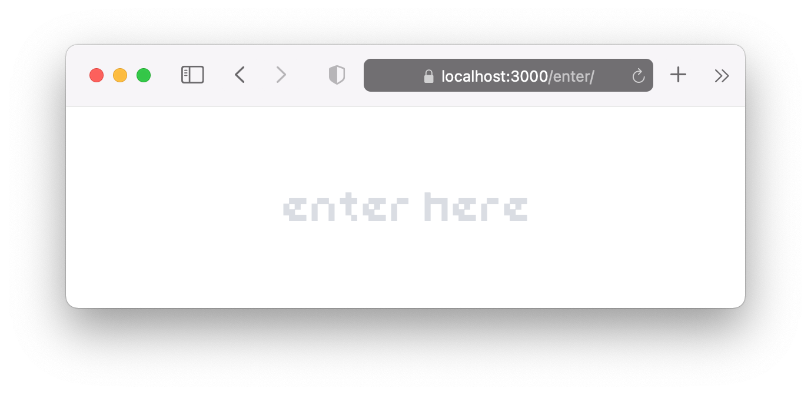

# Lockpage Full Stack Starter

Deploy a new password protected Next.js app to AWS securely in 10 minutes.

* [Overview](#overview)
* [Getting Started](#getting-started)
  * [Prerequisites](#prerequisites)
  * [Installation](#installation)
  * [Try the lockpage locally](#try-the-lockpage-locally)
  * [Try the variations directly](#try-the-variations-directly)
  * [Use https locally](#use-https-locally)
  * [Deploy to production with AWS CDK & AWS CodePipeline](#deploy-to-production-with-aws-cdk--aws-codepipeline)
  * [Destroy the CDK stack](#destroy-the-cdk-stack)
* [Serving different variations for different passwords](#serving-different-variations-for-different-passwords)
  * [Adding an app variation](#adding-an-app-variation)
* [Development](#development)
  * [Database and data models](#database-and-data-models)
  * [Feature flags](#feature-flags)
* [Testing](#testing)
  * [Jest unit tests](#jest-unit-tests)
  * [Testcafe integration tests](#testcafe-integration-tests)
* [Appendix: Preparing the AWS Prerequisites](#appendix-preparing-the-aws-prerequisites)
  * [|1| Create an AWS account](#1-create-an-aws-account)
  * [|2| Configure the AWS Command Line Interface CLI](#2-configure-the-aws-command-line-interface-cli)
  * [|3| Register a Connection to your GitHub repository](#3-register-a-connection-to-your-github-repository)
  * [|4| Purchase or import a domain name in Route 53 $/year](#4-purchase-or-import-a-domain-name-in-route-53-year)
  * [|5| Create a Route 53 Hosted Zone for your domain $0.50/month](#5-create-a-route-53-hosted-zone-for-your-domain-050month)
  * [|6| Create or import an HTTPS Certificate in AWS Certificate Manager ACM](#6-create-or-import-an-https-certificate-in-aws-certificate-manager-acm)
* [Appendix: Full Stack](#appendix-full-stack)
* [Credits](#credits)

<br />

## Overview

Quickly deploy a new [Next.js](https://nextjs.org) app to AWS while protecting it behind a **"lockpage"**: a configurable password protection page where **different passwords** can serve **different variations** of the app, or different apps entirely.

<p></p>

It's secured by a **signed JSON Web Token (JWT)** and **signed cookie**. 

A complete AWS infrastructure is defined by the included **AWS Cloud Development Kit (CDK) stack** (see [Appendix: Full Stack](#appendix-full-stack) for an overview). After secrets configuration, you'll run one command to:

1.  Create **AWS infrastructure**
2.  Deploy your code from GitHub to a **https** url
3.  Configure **continuous deployment** to re-deploy changes automatically

All resources provisioned by the CDK stack **run for free** under the AWS Free Tier (for 12 months). Your costs are the **domain name** and associated **Route 53 Hosted Zone**, which are required to secure your infrastructure behind **HTTPS** (domain names run around *$10/year*; a Hosted Zone is *$0.50/month*).

## Getting Started

### Prerequisites

To try it locally, you will need:

*   `zsh` or `bash`
*   `wget` or `curl`
*   `rename`
*   `node` *(v16.x.x)*
*   `yarn` *(v1.x)*
*   *Docker Engine* installed and running

Later, to deploy to AWS, you will need:

1.  An **AWS account** created
2.  **AWS CLI** configured
3.  A **domain name** purchased in or imported into Amazon Route 53
4.  A Route 53 **Hosted Zone** created for domain name
5.  **Connection to GitHub** account/repo created in AWS Dev Tools
6.  ~~**HTTPS certificate** created or imported in AWS Certificate Manager~~ *(not needed as of 0.1.3)*

(See [Appendix: Preparing the AWS Prerequisites](#appendix-preparing-the-aws-prerequisites) for a detailed walkthrough)

### Installation

1.  `cd` to a project directory
2.  Run the install script via `wget` or `curl`:

    ```sh
    # (optionally replace zsh with bash)

    # wget
    $ zsh <(wget -qO- https://raw.githubusercontent.com/tw-space/lockpage-full-stack-starter/master/scripts/create-lockpage-app.zsh)

    # curl
    $ zsh <(curl -fsSo- https://raw.githubusercontent.com/tw-space/lockpage-full-stack-starter/master/scripts/create-lockpage-app.zsh)
    ```

### Try the lockpage locally

The starter is configured with **two variations** to start, initially called **main** and **guest**. These correspond to the pages stored under `src/pages/_main/` and `src/pages/_guest/` respectively. The correct password entered into the lockpage will serve either the **main** or **guest** variation.

To try this locally:

1.  Rename `.env/RENAME_TO.secrets.js` to `.secrets.js`
2.  In `.env/.secrets.js`, update `rootPwd` with the absolute path to your project directory
3.  To build the project and serve it locally in development mode, run:

    ```sh
    $ yarn serve:dev
    ```

4.  Visit http://localhost:3000 in a browser
5.  Enter inputs a few times
6.  Enter `main secret` to access the **main** app variation
7.  In the same tab, navigate to http://localhost:3000/enter via the address bar
8.  Enter `guest secret` to access the **guest** variation

### Try the variations directly

For faster development cycles, the development server can bypass the lockpage and serve the desired app variation directly. Additionally, doing so will enable **hot reloading**, so that app code changes reflect in the browser immediately.

To run the **main** variation directly:

1.  Run:

    ```sh
    $ yarn dev      # same as yarn dev:main
    ```

2.  Visit http://localhost:4000

To run the **guest** variation:

1.  Run:

    ```sh
    $ yarn dev:guest
    ```

2.  Visit http://localhost:4000

### Use https locally

By default, both development servers will run in *http*, not *https*. The starter simplifies the setup for **local https development**, however, this is true only for the **custom server** (started with `yarn serve:dev` or `yarn start:dev`, *not* the hot reloading server started with `yarn dev`). 

Run `yarn serve:dev` or `yarn https:local:setup` to get started.

### Deploy to production with AWS CDK & AWS CodePipeline

This starter streamlines your deployment to a fully functional and secure stack hosted on AWS and set up for **Continuous Deployment**. Your `cdk/my-app-cdk/` directory contains *Infrastructure as Code (IaC)*, a complete infrastructure stack written with the **AWS Cloud Development Kit (CDK)**, which defines and configures AWS elements in TypeScript. 

Once your AWS prerequisites are set up, the entire first-time stack and code deployment takes **less than 10 minutes**. All resources created by the stack **run for free** under the AWS Free Tier (which lasts 12 months from account creation) when no other resources are also running (in particular other Load Balancers, EC2, or RDS instances).

Here are the steps:

1.  Rename `cdk/my-app-cdk/.env/RENAME_TO.secrets.js` to `.secrets.js`
2.  Commit & push your new project to a GitHub repo
3.  Ensure the following are prepared for AWS (see [Appendix: Preparing the AWS Prerequisites](#appendix-preparing-the-aws-prerequisites) for a detailed walkthrough):
    1. An **AWS account** created
    2. **AWS CLI** configured
    3. A **domain name** purchased in or imported into Amazon Route 53
    4. A Route 53 **Hosted Zone** created for domain name
    5. **Connection to GitHub** account/repo created in AWS Dev Tools
    6. ~~**HTTPS certificate** created or imported in AWS Certificate Manager~~ *(not needed as of 0.1.3)*
4.  Set the proper values for these in `cdk/my-app-cdk/.env/.secrets.js`
5.  To serve your web app using free, properly signed HTTPS encryption, navigate to `cdk/create-certs/` and run `yarn cdk:full`. When successfully complete, destroy the stack, and set `useHttpsFromS3` to `'1'` in `cdk/my-app-cdk/.env/.secrets.js`.
6.  Optionally change any project secret defaults in `.env/.secrets.js`
7.  Put all project secrets prefixed with `jwt`, `secret`, or `dbProd` in your AWS SSM Parameter Store (see steps in `.env/.secrets.js`)
8.  From `cdk/my-app-cdk/`, synthesize and deploy your app infrastructure stack with:

    ```sh
    $ yarn cdk:full
    ```

9.  When that's complete, go to **CodePipeline console**, ignore the deployment error, and click **Release Change** to retry the deployment
10. When that's complete, visit your domain name (using **https**) in a browser
11. Push changes to master to **continuously deploy** your app to production

### Destroy the CDK stack

While all resources run for free under the Free Tier, it's a good practice to keep usage minimal by **regularly destroying** the **CDK stack** when not actively needing the production deployment:

1.  From `cdk/my-app-cdk/`, run:

    ```sh
    $ yarn cdk:destroy
    ```

## Serving different variations for different passwords

Your `src/pages/` directory looks like this:

```sh
├── pages/
│   ├── _app.page.jsx
│   ├── _document.page.jsx
│   ├── _guest/
│   │   ├── index.page.jsx
│   │   └── index.spec.js
│   ├── _main/
│   │   ├── index.page.jsx
│   │   └── index.spec.js
│   └── _middleware.page.js
```

Notice the two directories `_main/` and `_guest/`. Those are the two default **app variations** that are served for **different passwords**.

*   To visit the pages under `_main/`, type in at the lockpage the default password: `main secret`
*   To visit the pages under `_guest/`, type in at the lockpage the default password: `guest secret`

Once authenticated, the pages you have access to will *only* be those in your permitted directory. For example, after authenticating with `main secret`, you will only be served the pages under `_main/` — though they will appear to be served at the root — and you will not be able to access any pages under `_guest/`.

You may freely add an app variation in the following way:

### Adding an app variation

Let's add an app variation called `cinematic`.

1.  First, create a new directory `_cinematic/` inside `src/pages/`
2.  Next, open `_middleware.page.js`, also in `src/pages/`, and change the following:
    1.  Add the path `_cinematic/` to the array `pathBases`:

        ```js
        const pathBases = [
          '/_main',
          '/_guest',
          '/_cinematic',
        ]
        ```
    
    2.  Extend the first `pathname` check with `pathBases[2]`:

        ```js
        if (
          pathname.startsWith(`${pathBases[0]}`)
          || pathname.startsWith(`${pathBases[1]}`)
          || pathname.startsWith(`${pathBases[2]}`)
        ) {
          return res.rewrite('/404')
        }
        ```
    3.  Add a case to the switch statement like the following:

        ```js
        // ...
        case process.env.JWT_SUB_CINEMATIC:
          return res.rewrite(`${pathBases[2]}${pathname}`)
        // ...
        ```

3.  Now let's add that mystery environment variable and one other. Open `.env/.secrets.js`, and add **two environment variables**:

    ```js
    const jwtSubCinematic = 'cinematic' // a unique permissions identifier that no one will see        
    const secretKeyCinematic = '<PASSWORD>' // the password to access the cinematic variation

    module.exports = {
      jwtSubCinematic,
      secretKeyCinematic,
    }
    ```

4.  Open `.env/common.env.js`, and add **two entries**:

    ```js
    const envCommon = {
      JWT_SUB_CINEMATIC: '',
      SECRET_KEY_CINEMATIC: '',
    }
    ```

5.  Open `.env/production.env.js`, and add:

    ```js
    const {
      jwtSubCinematic,
      secretKeyCinematic,
    } = require('./.production.secrets.js')

    const envProduction = {
      JWT_SUB_CINEMATIC: jwtSubCinematic || '',
      SECRET_KEY_CINEMATIC: secretKeyCinematic || '',
    }
    ```

6.  Make those same additions to `.env/development.env.js` and `.env/testing.env.js`
7.  With that complete, open `server/index.js`, find the switch statement, and add the appropriate case:

    ```js
    switch (req.body[process.env.KEY_NAME]) {
      case process.env.SECRET_KEY_MAIN:
        jwtSub = process.env.JWT_SUB_MAIN
        break
      case process.env.SECRET_KEY_GUEST:
        jwtSub = process.env.JWT_SUB_GUEST
        break
      case process.env.SECRET_KEY_CINEMATIC:    // add this case
        jwtSub = process.env.JWT_SUB_CINEMATIC
        break
      default:
        res.status(500).json({ message: Strings.msg500ServerError })
    }
    ```

8.  Open `utils/auth.js`, and similarly extend the patterns that are there. There are **four** in total: **two** which will reference `process.env.SECRET_KEY_CINEMATIC` and **two** which will reference `process.env.JWT_SUB_CINEMATIC`
9.  Finally, put the secrets into **SSM Parameter Store** by running:

    ```sh
    $ aws ssm put-parameter --name "/<your-app>/prod/jwtSubCinematic" --value "<value>" --type "SecureString"
    $ aws ssm put-parameter --name "/<your-app>/prod/secretKeyCinematic" --value "<value>" --type "SecureString"
    ```

10. That's it! Run the server locally with `yarn serve:dev` to try it. Then to test in production, create pages under `_cinematic/`, commit & push your changes to GitHub, wait a few minutes for your changes to deploy, then visit your domain to check the result.

## Development

### Database and data models

This starter is configured to run and interface with **PostgreSQL** in local development and in production on an AWS RDS instance.

For **local development**, running `yarn dev` will first run a script that will walk you through any unmet steps for running a *Postgres* database container locally (namely to have *Docker Engine* installed and running).

This starter is preconfigured for **migration-based database development**, where all changes to a database are reflected in a sequence of **migration files**. Migration files are checked into a repository along with feature code, which makes the database effectively "versioned" alongside commits and releases.

The system for running and tracking migrations is enabled by [Flyway](https://flywaydb.org) whose Community version is free to use. As Flyway is Java based, this starter provides scripts to run Flyway commands in a Docker container spun up on demand.

Interacting with the database in client code is achieved through *Knex.js* database connections and *Objection.js* Model objects (which are built on *Knex.js*).

A quick way to understand how all the pieces fit together is with an illustration of a typical workflow of making a change to the database:

1.  You're working on version *0.0.0* of your app. You create a new sql file in `db/migrations` with a title following a very specific format, such as `V0.0.0_0__My_awesome_database.sql` (see [Flyway Migrations](https://flywaydb.org/documentation/concepts/migrations.html) for their naming conventions and requirements).

2.  You write the changes you want to make to your database in *sql*, for example:

    ```sql
    /* V0.0.0_0__My_awesome_database.sql */
    CREATE TABLE IF NOT EXISTS awesome_things (
      awesome_thing_id int GENERATED ALWAYS AS IDENTITY primary key,
      display_name text NOT NULL
    );
    ```

3.  You add an additional sql migration file to insert test content into your database called `V0.0.0_1__TEST_Insert_awesome_things.sql`. Flyway will run migration files **in order** by their version number (in this case, `0.0.0_1` after `0.0.0_0`). (For ideas on how to organize release and test migration files separately, see [Organising your migrations](https://flywaydb.org/blog/organising-your-migrations).

4.  You're ready to create your database. You run `yarn db:dev:setup` (or simply `yarn dev`) to run Flyway's `migrate` command on a new local Postgres database, all with Docker Compose. The script completes successfully and your local database is initialized and ready to go.

5.  (Optional) You want to interact with the local database directly. You make sure `postgresql` is installed, and you run `yarn db:dev:connect:psql` to connect to the local database with `psql`. 

6.  In your Next.js pages and components, you interface with your database primarily through Objection.js Models which you create in the `models/` directory. You create `models/AwesomeThings.js`, which defines a model for your database table per the guidelines at [Objection.js](https://vincit.github.io/objection.js/). You sometimes may interface with the database more directly by importing and using the `db/knex` object.

7.  You write your pages' database queries as much as possible inside `getServerSideProps()` to achieve *server-side rendering*. (See [Data Fetching: getServerSideProps](https://nextjs.org/docs/basic-features/data-fetching/get-server-side-props)) 

8.  You run `yarn dev` to interact with your app in the browser. `yarn dev` will also run all migrations found in `db/migrations/` on the locally running Postgres container.

9.  You write tests for your database in `db/test/` and tests for your models in `models/`. These will automatically be discovered when running `yarn jest` and the `yarn jest:all:` variants. You can also run them specifically with `yarn jest:db` and `yarn jest:models`.

10. (Optional) Your database and migration files look good and you're ready to check in your changes. You push your changes to a development branch then create a Pull Request into master. This triggers a [GitHub Actions](https://docs.github.com/en/actions) workflow which sets up all dependencies, including Flyway and Postgres, and ultimately runs `yarn jest:all:prod` to run all discoverable Jest tests.

11. You commit your changes to master. Your app is already deployed to AWS via the included CDK stack and it is running a Free Tier RDS PostgreSQL instance. CodePipeline detects your changes in the repository and starts a CodeDeploy deployment. As part of the deployment scripts, a Flyway container is spun up to run `migrate` on your production database. Your database and app code update successfully and your changes are live.

### Feature flags

This starter includes basic support for **feature flags** to support [trunk-based development](https://trunkbaseddevelopment.com). 

To illustrate, when beginning a new feature, you can:

1.  Add a new flag in `.env/development.flags.js` with name `FLAG_NEW_FEATURE` and set its value to `'on'`:

    ```js
    // .env/development.flags.js
    const flagsDevelopment = {
      FLAG_NEW_FEATURE: 'on',
    }
    ```

    *Note:* Flags' environment variable names must be in **snake uppercase** format and begin with `'FLAG_'`.
    
2.  In app code, write new implementation logic that runs in development mode but **not in production** by surrounding it like in this example:

    ```js
    import * as flag from '../utils/code-flags'

    if (flag.isEnabled('newFeature')) {
      /* Only runs if process.env.FLAG_NEW_FEATURE is set to 'on' */
    }
    else { /*...*/ }
    ```

3.  Alternatively when **testing variants**, use `getVariant()` to check a flag's value directly:

    ```js
    import * as flag from '../utils/code-flags'
    
    if (flag.getVariant('featureWithVariant') === 'blue') {
      /* Only runs if process.env.FLAG_FEATURE_WITH_VARIANT has value 'blue' */
    } else if (flag.getVariant('featureWithVariant') === 'green') {
      /* Only runs if process.env.FLAG_FEATURE_WITH_VARIANT has value 'green' */
    }
    else { /*...*/ }
    ```
    
4.  Commit this code into the trunk knowing it **won't affect production code**.
5.  When ready to **enable in production**, add the appropriate flag in `.env/production.flags.js` and push to remote master:

    ```js
    // .env/production.flags.js
    const flagsProduction = {
      FLAG_NEW_FEATURE: 'on',
    }
    ```

6.  Finally, when the feature is demonstrated to work in production and all is well, remember to **remove this flag's code** to keep things tidy.

## Testing

The starter includes **Jest unit tests** and **Testcafe integration tests**.

### Jest (unit tests)

Run the included **Jest unit tests** with:

```sh
$ yarn jest:all:build   # builds all, starts custom server, then runs all tests
$ yarn jest             # runs all tests except server (same as yarn jest:all:noserver)
$ yarn jest:app         # only runs tests under src/
```

### Testcafe (integration tests)

Testcafe can run **integration tests** in an actual (headless) browser. It supports **several browsers**, including Chrome, Firefox, and Safari.

1.  First, start the server. You can do it one of two ways:

    ```sh
    $ yarn dev          # starts hot reloading src/pages/_main/ at http://localhost:4000
    $ yarn start:test   # requires 'yarn build:all:test' first; runs at https://localhost:3000
    ```

2.  Depending on how you started the server, run `testcafe`:

    ```sh
    $ yarn testcafe       # test against http://localhost:4000
    $ yarn testcafe:main  # test against https://localhost:3000
    ```

### PR Tests

GitHub will automatically run **PR tests** via the included [GitHub Actions](https://docs.github.com/en/actions/learn-github-actions) workflow when creating a new Pull Request into the *master* branch.

## Appendix: Preparing the AWS Prerequisites

To configure your app for deployment to AWS, you will need to provide these six values in `cdk/my-app-cdk/.env/.secrets.js`:

```js
const cdkGitHubConnectionArn = ''
const cdkGitHubOwner = ''
const cdkGitHubRepo = ''
const cdkGitHubRepoBranch = ''
const cdkHostedZoneId = ''
const cdkHostname = ''
```

You will know these values after these **six steps**:

### `|1|` Create an AWS account

Here's an overview of the first steps: [Prerequisites to use the AWS CLI version 2 | AWS](https://docs.aws.amazon.com/cli/latest/userguide/getting-started-prereqs.html)

1.  Go to [AWS sign up](https://portal.aws.amazon.com/billing/signup) and create an account for free.
    *   *Note:* Billing details are required, but all resources created by the included CDK stack will **run for free** under the [AWS Free Tier](https://aws.amazon.com/free/) (which lasts for 12 months from account creation)
2.  *(Optional, but recommended)* Create a non-root **IAM user account** following these steps: [Step 2: Create an IAM user account](https://docs.aws.amazon.com/cli/latest/userguide/getting-started-prereqs.html#getting-started-prereqs-iam)

### `|2|` Configure the AWS Command Line Interface (CLI)

1.  [Step 3: Create an access key ID and secret access key](https://docs.aws.amazon.com/cli/latest/userguide/getting-started-prereqs.html#getting-started-prereqs-keys)
2.  [Install or update the latest version of the AWS CLI](https://docs.aws.amazon.com/cli/latest/userguide/getting-started-install.html)
3.  Run `aws configure` to input your *access key ID* and *secret access key*: [Quick setup](https://docs.aws.amazon.com/cli/latest/userguide/getting-started-quickstart.html)

Your AWS CLI should now be good to go.

### `|3|` Register a Connection to your GitHub repository

1.  First, push your new project to a **GitHub repository**
    *   Your **username** will be `cdkGitHubOwner`
    *   The **repository name** will be `cdkGitHubRepo`
2.  Sign in to the [AWS Console](https://console.aws.amazon.com/console/home)
3.  Use the search box at the top to go to the **CodePipeline console**
4.  In the left nav, expand **Settings**, then choose **Connections**
5.  Click **Create connection**
6.  Choose **GitHub**, then choose **Connect to GitHub**, then follow the instructions
    *   Choosing to authorize a selected repository or all repositories (past and future) is up to you
7.  Back on the **Connections page**, copy the **ARN** to the GitHub Connection just created (this will be `cdkGitHubConnectionARN`)

### `|4|` Purchase or import a domain name in Route 53 ($/year)

*Note:* This step will require an annual fee (*~$10/year*).

1.  Go to the **Amazon Route 53 console**
2.  In the *Dashboard*, scroll to **Register domains**, then either **search availability** for a new domain name or choose **transfer your existing domains**
3.  Follow the instructions until you own or have transferred a domain name
4.  Record the domain name in `cdkHostname` (e.g. `const cdkHostname = 'yourdomain.com'`).

### `|5|` Create a Route 53 Hosted Zone for your domain ($0.50/month)

*Note:* This step will cost *$0.50/month* with low traffic.

1.  Go to the **Amazon Route 53 console**
2.  In the left nav, choose **Hosted zones**
3.  Choose **Create hosted zone**
4.  Type in the **domain name**, then choose **Create hosted zone**
5.  Once created, enter the new hosted zone entry details
6.  Expand the **Hosted zone details**
7.  Copy the **Hosted zone ID** into `cdkHostedZoneId`

*Note:* To **stop charges**, you must **delete** the hosted zone.

### ~~`|6|` Create (or import) an HTTPS Certificate in AWS Certificate Manager (ACM)~~ *(not needed as of 0.1.3)*

1.  ~~Go to the **AWS Certificate Manager (ACM) console**~~
2.  ~~Choose either **Request a certificate** or **Import a certificate** (either service is **free**)~~
3.  ~~Follow the instructions until you have an HTTPS Certificate in AWS Certificate Manager~~
4.  ~~Copy its **ARN** into `cdkHttpsCertificateArn`~~

## Appendix: Full Stack

-   **Front End**
    *   [Next.js](https://nextjs.org)
-   **Server**
    *   [Express.js](https://expressjs.com)
    *   [Next.js](https://nextjs.org)
-   **Testing**
    *   [Jest](https://jestjs.io)
    *   [Supertest](https://github.com/visionmedia/supertest)
    *   [Mock Service Worker](https://mswjs.io)
    *   [Testcafe](https://testcafe.io)
    *   [GitHub Actions](https://docs.github.com/en/actions)
-   **Database & Data Model**
    *   [Amazon RDS for PostgreSQL](https://aws.amazon.com/rds/postgresql/)
    *   [PostgreSQL](https://www.postgresql.org)
    *   [Flyway](https://flywaydb.org)
    *   [Knex.js](https://knexjs.org)
    *   [Objection.js](https://vincit.github.io/objection.js/)
    *   [Docker](https://www.docker.com)
-   **Infrastructure as Code (IaC)**
    *   [AWS Cloud Development Kit (CDK)](https://aws.amazon.com/cdk/)
-   **Deployment**
    *   [AWS CodeDeploy](https://aws.amazon.com/codedeploy/)
-   **Continuous Delivery**
    *   [AWS CodePipeline](https://aws.amazon.com/codepipeline/)
-   **Compute**
    *   [Amazon EC2](https://aws.amazon.com/ec2/)
    *   [AWS Autoscaling](https://aws.amazon.com/autoscaling/)
-   **Network**
    *   [Amazon VPC](https://aws.amazon.com/vpc/)
    *   [AWS Elastic Load Balancing](https://aws.amazon.com/elasticloadbalancing/)
    *   [Amazon Route 53](https://aws.amazon.com/route53/)
    *   [Certbot (Let's Encrypt)](https://certbot.eff.org)
    *   [AWS Certificate Manager](https://aws.amazon.com/certificate-manager/)
-   **Artifact Storage**
    *   [Amazon S3](https://aws.amazon.com/s3/)
-   **Styles**
    *   [Stitches](https://stitches.dev)
-   **Linting & Formatting**
    *   [ESLint](https://eslint.org)
-   **Code Repository**
    *   [GitHub](https://github.com)
-   **Miscellaneous**
    *   *Environment variables:* [env-cmd](https://github.com/toddbluhm/env-cmd)
    *   *Transpiler:* [Babel](https://babeljs.io)
    *   *Port forwarding*: `socat`

## Credits

The font used for the lockpage is [PixL](https://www.1001fonts.com/pixl-font.html) by Keith Bates at K-Type Foundry
